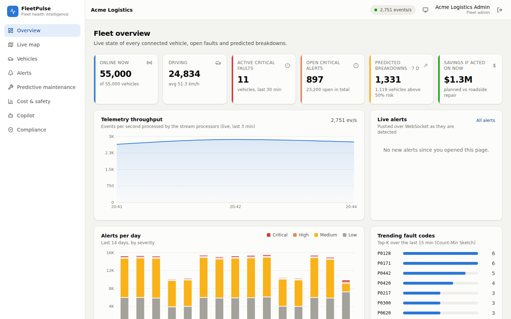
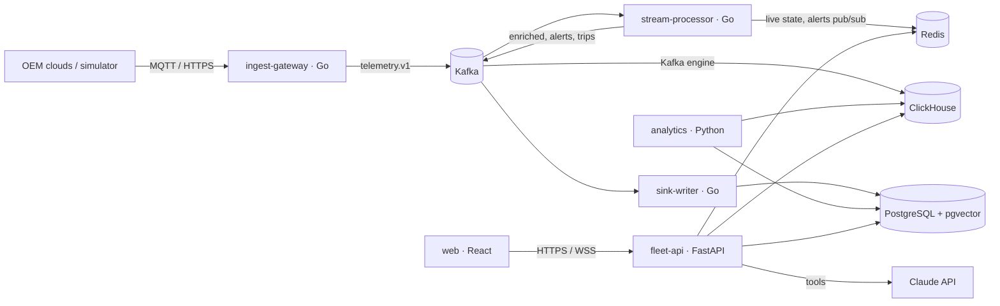
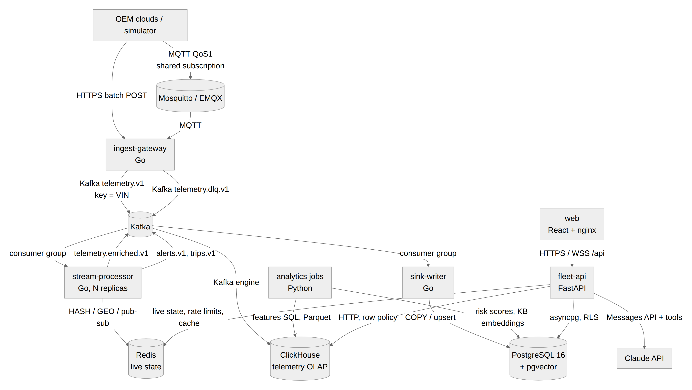

# FleetPulse: connected-fleet health intelligence

FleetPulse ingests telemetry from **100,000 connected vehicles** reported by
three incompatible OEM clouds, raises **critical faults within a second**, and
tells each fleet which vehicles will **break down in the next 7 days, why, and
what acting now saves**, for three competing fleet operators on one secure,
multi-tenant platform.



## The problem

A roadside breakdown costs a commercial fleet ~$2,400 (tow, emergency repair,
lost day) against ~$520 for the same repair planned in the workshop. Today's
tooling either floods managers with raw fault codes or misses slow
degradations that never cross a fixed threshold, and every OEM cloud speaks a
different format. **Primary user: the fleet maintenance manager.**

## What it does

| | |
|---|---|
| **Unified ingestion** | MQTT and HTTPS from three OEM formats (nested metric JSON, flat imperial JSON, SI signal lists) mapped by declarative adapters; VIN check digits, range and clock checks; bad records to a DLQ, never the whole batch |
| **Real-time detection** | 12 sustained-condition rules (overheat, low voltage, EV pack temperature, crash, risky driving, idling…) with dedup, out-of-order handling and trip segmentation; alerts pushed over WebSocket |
| **Predictive maintenance** | Per-component gradient-boosted models; 7-day breakdown risk with reasons and dollar impact. On held-out data: **precision 0.91 vs 0.41** for today's threshold rules at the same workshop capacity, **$8.3M vs $4.3M** net savings |
| **Maintenance copilot** | Claude with tenant-scoped tools; answers from live data and *proposes* work orders that a manager approves |
| **Trust by design** | OAuth2/JWT, RBAC, row-level security per tenant, location masking and driver pseudonyms, AES-256 PII, hash-chained audit log, right-to-erasure API |

## Architecture





Details: [architecture](docs/architecture.md) · [ERD](docs/erd.md) ·
[ADRs](docs/adr/) · [capacity](docs/capacity.md) ·
[security & STRIDE](docs/security.md) · [algorithms](docs/algorithms.md) ·
[query optimisation](docs/sql-optimization.md) · [AI/ML](docs/ai-ml.md) ·
[testing](docs/testing.md) · [observability](docs/observability.md) ·
[OpenAPI](docs/api/openapi.json)

## Quick start (one command)

Requirements: Docker with Compose v2, **4+ CPU cores, 12 GB RAM, 30 GB free
disk** for the full 100K-vehicle dataset (measured: ~6 GB RAM steady state,
more while the model trains; ~12 GB of images plus ~10 GB of data).

```bash
docker compose up -d --build
```

This builds the images, starts Kafka, PostgreSQL, ClickHouse, Redis and
Mosquitto, runs migrations, **seeds 100,000 vehicles with 60 days of history**
(~1.5 minutes), trains and scores the model, and starts the simulator,
pipeline, API, web app and monitoring. First build takes 5–10 minutes.

| URL | What |
|---|---|
| http://localhost:3000 | Web app |
| http://localhost:8000/docs | API (OpenAPI / Swagger UI) |
| http://localhost:3001 | Grafana (anonymous viewer) |
| http://localhost:9090 | Prometheus |
| http://localhost:8080 | Ingest gateway (`POST /v1/ingest/{oem}`) |

**Demo accounts** (password `FleetPulse!2026`):

| Tenant | Admin | Maintenance manager | Analyst | Viewer |
|---|---|---|---|---|
| Acme Logistics (55K vehicles) | `admin@acme.demo` | `maint@acme.demo` | `analyst@acme.demo` | `viewer@acme.demo` |
| RapidRide Rentals (30K) | `admin@rapidride.demo` | `maint@rapidride.demo` | `analyst@rapidride.demo` | `viewer@rapidride.demo` |
| GreenFleet EV (15K) | `admin@greenfleet.demo` | `maint@greenfleet.demo` | `analyst@greenfleet.demo` | `viewer@greenfleet.demo` |
| Platform | `ops@fleetpulse.dev` (platform operator) | | | |

Try it: `scripts/send-sample.py` posts one payload per OEM format;
`scripts/send-sample.py pinnacle --corrupt` shows a bad record going to the
DLQ while the rest of the batch is accepted.

Smaller machine? `SIM_VEHICLES=20000 SEED_HISTORY_DAYS=21 docker compose up -d --build`
(the simulator and the seed must use the same vehicle count).

## Configuration

All settings are environment variables (12-factor); see
[`.env.example`](.env.example). Every variable has a local-only default, so no
`.env` is needed to start. Set `ANTHROPIC_API_KEY` to enable the LLM copilot
(without it, a deterministic offline planner answers from the same tools).
Behind a TLS-inspecting proxy, build with `EXTRA_CA_FILE=/path/to/ca.pem`.

## Tests

| Suite | Command | Result |
|---|---|---|
| Go unit + contract | `cd services/pipeline && go test -race ./...` | 84 tests, 84.3% coverage |
| API unit + Testcontainers integration | `cd services/fleet-api && pip install -e ".[test]" && pytest --cov=app` | 51 tests, 87% |
| Analytics unit + Testcontainers | `cd services/analytics && pip install -e ".[test]" && pytest --cov=analytics` | 16 tests, 90% |
| Web | `cd services/web && npm ci && npm test` | 14 tests |
| BDD acceptance (stack running) | `cd tests/bdd && behave features` | 9 scenarios pass |
| Load | `k6 run -e BASE_URL=http://localhost:8000 tests/load/api.js` | 100 req/s: p95 135 ms, p99 408 ms, 0 errors |
| Chaos | `python tests/chaos/chaos.py` | 5/5 experiments pass |
| Query plans | `scripts/explain-evidence.sh` | before/after in `docs/evidence/explain` |

CI (`.github/workflows/ci.yml`) runs all of the above plus gitleaks, Semgrep,
govulncheck, Trivy (filesystem, IaC, images), SBOMs, Helm/kubeconform,
Terraform validation, a compose-based end-to-end job with k6 smoke and an
OWASP ZAP baseline.

## Deploying to a cloud

```bash
cd infra/terraform/aws && terraform init && terraform apply     # VPC, EKS, RDS, ElastiCache, MSK, S3, KMS, Secrets Manager
helm upgrade --install fleetpulse deploy/helm/fleetpulse -n fleetpulse --create-namespace \
  -f deploy/helm/fleetpulse/values-aws.yaml                     # or values-gcp.yaml
```

See [infra/terraform/aws/README.md](infra/terraform/aws/README.md).

## Repository layout

```
contracts/        JSON Schemas per Kafka topic + sample payload per OEM
db/               PostgreSQL migrations, ClickHouse DDL
deploy/           Helm chart, Mosquitto, ClickHouse, Prometheus/Grafana config
docs/             architecture, ADRs, security, algorithms, evidence, screenshots
infra/terraform/  AWS infrastructure
scripts/          evidence capture, sample sender
services/         pipeline (Go), fleet-api (Python), analytics (Python), web (React)
tests/            BDD, load (k6), chaos
```

## Known issues and limitations

* **End-to-end 100K events/s was not demonstrated on the 4-vCPU build machine**
  (it sustained ~4K events/s with every component sharing four cores). The
  100K figure is sized from single-core stage benchmarks (processor ~120K
  events/s/core, gateway ~100K records/s/core) and horizontal scaling; see
  [capacity.md](docs/capacity.md).
* The model is trained and evaluated on **synthetic** data; the baseline
  comparison is meaningful, the absolute numbers are not a claim about a real
  fleet.
* The LLM copilot path was not exercised in the build environment (no API key);
  the offline planner and all guardrails are tested.
* Locally, MQTT uses passwords and ACLs; production uses mTLS (supported by
  the gateway, configured in the Helm chart).
* `audit_log` is not partitioned yet; PostgreSQL retention jobs (old trip
  partitions, risk history) are policies, not yet automated.
* The drivers' `safety_opt_in` flag is recorded but not yet enforced in scoring.
* The 2-hour soak profile exists but was not run; security scans are
  configured in CI but were not executed on the build machine.
* The local Redis image (7.4) is RSALv2/SSPLv1 licensed; see
  [declarations](docs/declarations.md).
