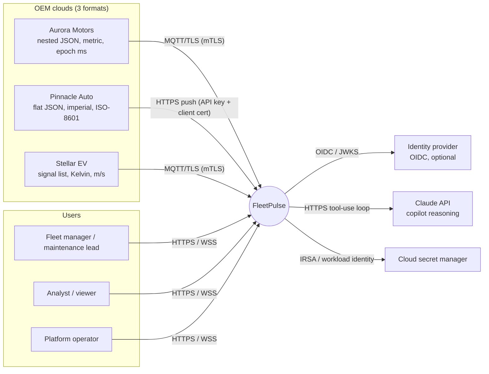
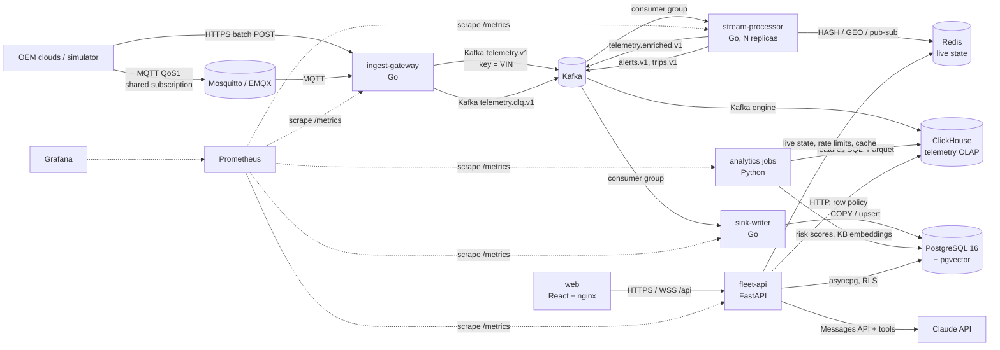
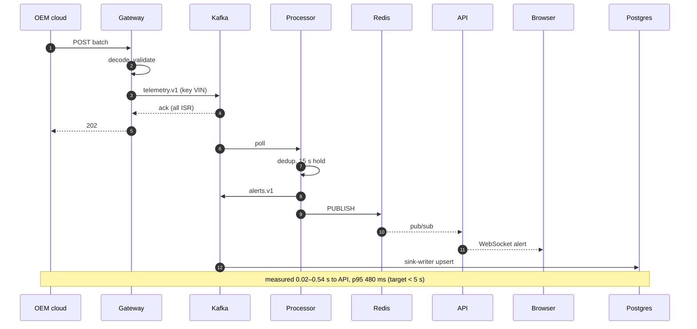
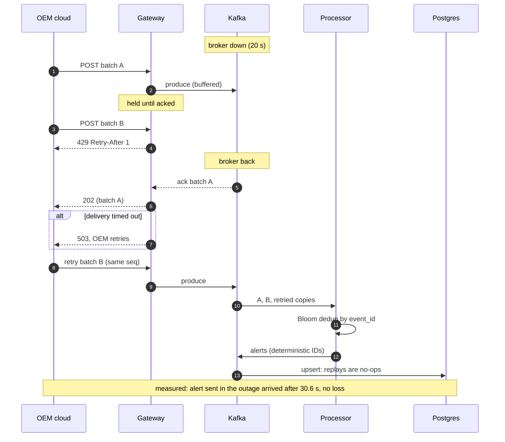
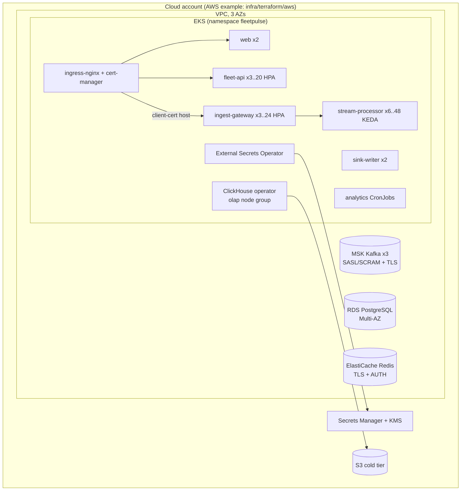
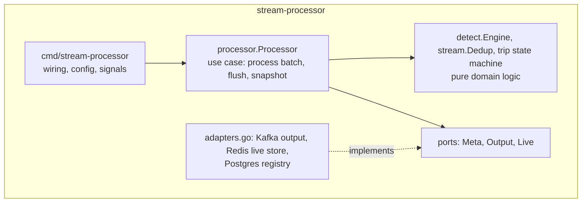

# FleetPulse architecture

FleetPulse ingests telemetry from 100,000 connected vehicles reported by three
OEM clouds, detects faults in real time, predicts breakdowns seven days ahead
and serves three competing fleet operators from one multi-tenant platform.

## 1. System context (C4 level 1)



## 2. Containers (C4 level 2)



| Container | Responsibility | Scales on |
|---|---|---|
| `ingest-gateway` | Authenticate OEM connectors, decode 3 formats through declarative adapters, validate (VIN check digit, ranges, clock skew), canonicalise, produce to Kafka; malformed records to the DLQ; back-pressure (bounded in-flight, 429/503) | CPU (HPA) |
| `stream-processor` | Per-partition state: Bloom-filter dedup, out-of-order handling, 12 detection rules, trip segmentation, idle cost, live state to Redis, KPI snapshots, top-K fault codes | Consumer lag (KEDA) / CPU |
| `sink-writer` | Alerts and trips from Kafka to PostgreSQL (idempotent, keyed by deterministic IDs) | Partitions of `alerts.v1`/`trips.v1` |
| ClickHouse Kafka engine | Enriched telemetry to `fleet.telemetry` (ReplacingMergeTree) and rollup MVs | Kafka engine consumers |
| `fleet-api` | OAuth2/JWT, RBAC, tenant isolation, keyset pagination, rate limits, WebSocket stream, copilot, compliance | CPU (HPA), stateless |
| `analytics` | Feature extraction (ClickHouse), training/evaluation, daily scoring, knowledge-base embeddings, read-model refresh | CronJobs |
| `web` | SPA served by nginx; same-origin proxy to the API | Replicas |

## 3. Life of one telemetry event

Measured on the docker compose stack (4 vCPU) with 100K vehicles reporting
at ~4K events/s; benchmark figures from `docs/evidence/pipeline-benchmarks.txt`.

| # | Hop | Mechanism | Latency |
|---|---|---|---|
| 1 | Vehicle → OEM cloud → FleetPulse edge | OEM batches (≤ 500 records) over MQTT QoS 1 or HTTPS | network-bound (outside our control) |
| 2 | Gateway decode + validate | Adapter per OEM, VIN check digit, range checks | ~10 µs/record (≈100K records/s/core) |
| 3 | Gateway → Kafka | idempotent producer, acks=all, lz4, linger 5 ms | 5–15 ms |
| 4 | Kafka → stream processor | consumer group, per-VIN ordering by key | 1–10 ms |
| 5 | Processing | dedup, rules, trips, enrichment | ~8 µs/event (≈116–134K events/s/core) |
| 6 | Alert → API / WebSocket | Redis pub/sub (instant) and `alerts.v1` → sink-writer → PostgreSQL | **p95 480 ms** (Grafana), sentinel alert visible via API in 0.02–0.54 s |
| 7 | Live state → dashboard | Redis HASH/GEO flushed every 500 ms; KPI snapshot + WebSocket push every 1 s | per-vehicle ≤ ~0.8 s; KPI tiles ≤ ~2 s |
| 8 | Enriched → ClickHouse | Kafka engine + materialized views | seconds (history/analytics only) |
| 9 | Nightly | features → model → `risk_score` → read model | daily batch |

Ingest-to-processed p95 is 239 ms (`processor_ingest_to_process_seconds`).

### Critical flow: overheating vehicle to manager's screen



### Failure path: Kafka unavailable, OEM retries, duplicates



The gateway never acknowledges a batch before Kafka has it (`acks=all`); above
the producer's high-water mark it answers 429 with `Retry-After`, and if
delivery times out it answers 503. Either way the OEM retries, the retried
records carry the same `(OEM, VIN, sequence)` and therefore the same
`event_id`, the processor's Bloom filter drops them, and any alert derived
twice has the same deterministic ID, so the PostgreSQL upsert is a no-op.
Rendered diagrams: `docs/diagrams/*.png`.

## 4. Data architecture (polyglot persistence)

| Store | Data | Why this store | CAP choice |
|---|---|---|---|
| **Kafka** | Raw, enriched, alerts, trips, DLQ | Durable, replayable log; ordering per VIN; decouples ingest from processing | CP (RF 3, `min.insync.replicas=2`, `acks=all`, no unclean election) |
| **ClickHouse** | 1 Hz telemetry, daily features, hourly rollups, reject log | Columnar compression (31 B/row vs 407 B JSON), primary-key pruning on `(tenant_id, vin, ts)`, sub-second scans over billions of rows | AP-leaning (async replication, ReplacingMergeTree converges duplicates) |
| **PostgreSQL 16** | 3NF system of record: tenants, users, fleets, vehicles, drivers (PII encrypted), alerts, work orders, trips (partitioned), risk scores, audit chain, agent actions; `pgvector` knowledge base | Transactions, constraints, RLS for tenant isolation, joins for the operational UI | CP (synchronous commit, Multi-AZ failover) |
| **Redis** | Live vehicle state (HASH + GEO), KPI snapshots, pub/sub for alerts, rate-limit buckets, response cache, WebSocket tickets | Sub-millisecond reads for the live map; state is rebuildable from the stream | AP (a wipe loses nothing durable: verified in the chaos run) |

Details: [ERD](erd.md) · [capacity and retention](capacity.md) · [query optimisation](sql-optimization.md).

## 5. Deployment view



* **Namespaces and policies:** one namespace per environment; a default-deny
  `NetworkPolicy` with explicit allows (ingress controller → web/API/gateway,
  pods → data-service CIDRs, `fleet-api` → HTTPS for the LLM API, Prometheus →
  metrics ports). Metadata endpoint blocked.
* **Pods:** non-root UID 10001, read-only root filesystem, all capabilities
  dropped, seccomp `RuntimeDefault`, zone and node spreading, PDBs,
  rolling updates with `maxUnavailable: 0` for stateless tiers.
* **Secrets:** generated by Terraform into Secrets Manager (KMS), synced by
  External Secrets Operator; nothing secret in Git, images or Helm history.
* **Migrations:** Helm hook Job (`post-install,pre-upgrade`) so new code never
  meets an old schema.

**Cloud-agnostic:** the chart only needs endpoints and a secret store, so the
same chart runs on GKE (`values-gcp.yaml`: Cloud SQL, Memorystore, Managed
Kafka, GCS) or locally (`docker compose up`). Everything in the data path is
open source (Kafka, ClickHouse, PostgreSQL, Redis, Mosquitto/EMQX); managed
services are substitutes, not dependencies.

## 6. Service internals (layering)

The Go pipeline and the API both follow ports and adapters: domain logic has
no I/O and is tested without infrastructure; adapters implement narrow
interfaces.



| Layer | FleetPulse example | Must not |
|---|---|---|
| Presentation / API | `services/fleet-api/app/api/*` (routing, validation, auth dependencies, problem+json) | Contain SQL or business rules |
| Application / service | `app/services/*`, `internal/processor`, `analytics/jobs.py` | Depend on a concrete broker/DB client type (ports: `Output`, `Live`, `Sink`) |
| Domain | `internal/detect`, `internal/stream`, `internal/vin`, `internal/dtc`, `analytics/model.py` | Import framework or infrastructure code |
| Infrastructure | `internal/platform`, `processor/adapters.go`, `app/infra/*` | Leak driver types upward |

Repository layout:

```
contracts/        JSON Schemas for every topic + one sample payload per OEM
db/               PostgreSQL migrations (3NF, RLS, partitions, read models), ClickHouse DDL
deploy/           Helm chart, Mosquitto, ClickHouse and observability config
docs/             architecture, ERD, ADRs, security, algorithms, evidence, screenshots
infra/terraform/  AWS (VPC, EKS, RDS, ElastiCache, MSK, S3, KMS, Secrets Manager)
scripts/          evidence capture (EXPLAIN before/after)
services/
  pipeline/       Go: simulator, ingest-gateway, stream-processor, sink-writer, migrate
  fleet-api/      Python FastAPI: REST, WebSocket, copilot, compliance
  analytics/      Python: features, predictive model, scoring, knowledge base
  web/            React + TypeScript + Tailwind, served by nginx
tests/            BDD (behave), load (k6), chaos
```
