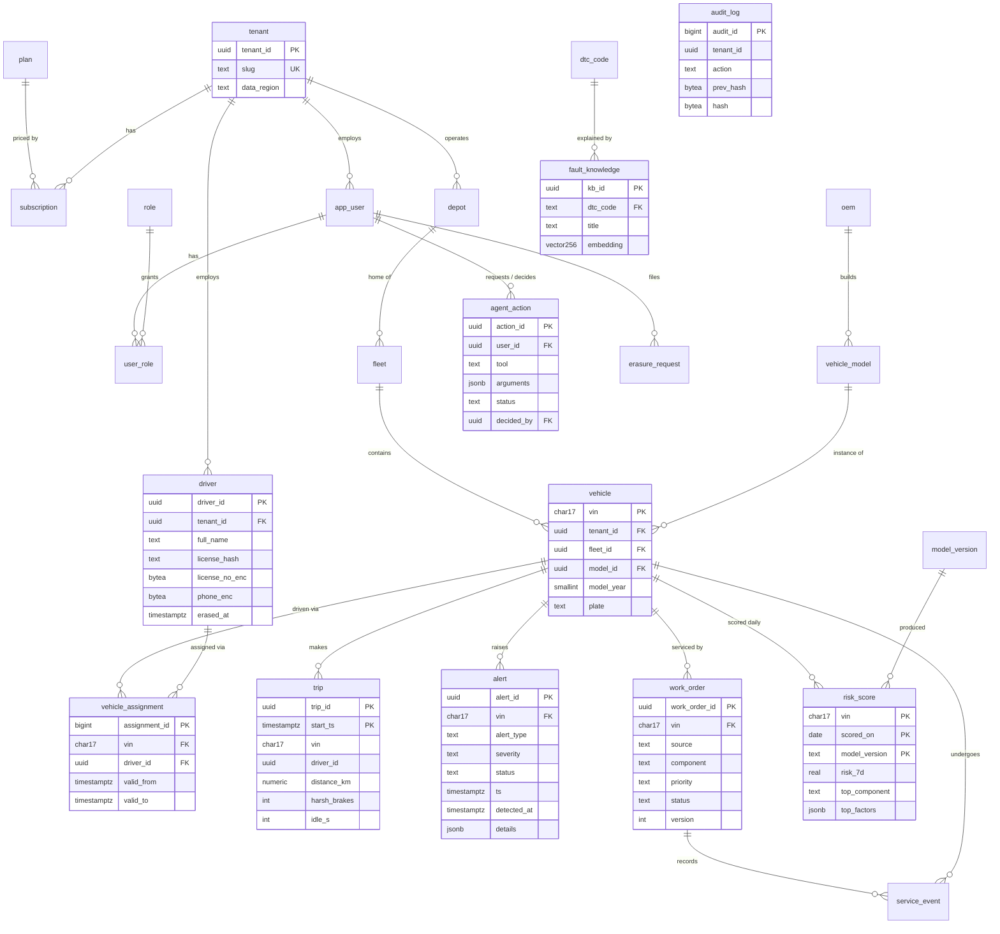

# Relational model (PostgreSQL 16)

Source: `db/postgres/migrations/001_core_schema.sql` (tables),
`002_indexes_partitions_views.sql` (indexes, partitions, risk read model),
`003_security_rls_audit.sql` (roles, RLS, audit hash chain),
`005_read_models.sql` (CQRS read models).

## Normalisation

The core is in third normal form: every non-key attribute depends on the key,
the whole key and nothing but the key. Examples:

* OEM facts live in `oem`, model facts in `vehicle_model`; a vehicle only
  references its model (`vehicle → vehicle_model → oem`), so a model's
  powertrain or battery size is stored once.
* Driver ↔ vehicle is many-to-many over time and lives in
  `vehicle_assignment` with a validity interval; a partial unique index allows
  exactly one open assignment per vehicle.
* Roles are a separate relation (`user_role`) rather than an array on the user.

## Deliberate denormalisation (and why)

| Where | What | Why |
|---|---|---|
| `tenant_id` on `alert`, `trip`, `work_order`, `service_event`, `risk_score`, `vehicle_assignment` | Derivable from `vehicle` (transitive dependency) | Row-level security evaluates `tenant_id = app_tenant()` on the row itself, with no join per row; every tenant-scoped index leads with `tenant_id`. Composite FKs such as `(fleet_id, tenant_id) → fleet` stop the copy from disagreeing with its parent. |
| `trip` has no FK to `vehicle`; partitioned by month | Referential check left to the producer | High-volume append from the sink; partition pruning and cheap retention (`DROP PARTITION`). VINs are validated upstream and trips reference only registered vehicles. |
| `alert.details`, `risk_score.top_factors`, `agent_action.arguments` as `jsonb` | Semi-structured payloads | Rule-specific evidence and model explanations vary by type and are only ever read whole. |
| `mv_vehicle_risk_current`, `mv_driver_safety`, `mv_alert_daily` | Materialised read models | CQRS read side: turns 1–3 s aggregates into 1–36 ms lookups (see [sql-optimization.md](sql-optimization.md)); refreshed `CONCURRENTLY` by the analytics jobs. |
| Telemetry not in PostgreSQL | Kept in ClickHouse | 8.6 billion rows/day at full scale; see [capacity.md](capacity.md). |

## Integrity and security features in the schema

* **RLS** on every tenant table; the API connects as `fleetpulse_api` (no
  `BYPASSRLS`) and sets `app.tenant_id` per transaction. Materialised views
  cannot carry RLS, so they are exposed only through `security_barrier` views
  filtered by `app_tenant()`.
* **PII** (`driver.license_no_enc`, `phone_enc`) encrypted with `pgcrypto`
  (AES-256); `license_hash` supports lookup without decryption.
* **Audit chain:** a trigger computes `hash = sha256(prev_hash || row)`, so
  editing or deleting any past row breaks verification
  (`GET /api/v1/compliance/audit/verify`).
* **Optimistic locking:** `work_order.version`.
* **Idempotency:** deterministic UUIDs for alerts and trips; unique keys make
  replays no-ops.
