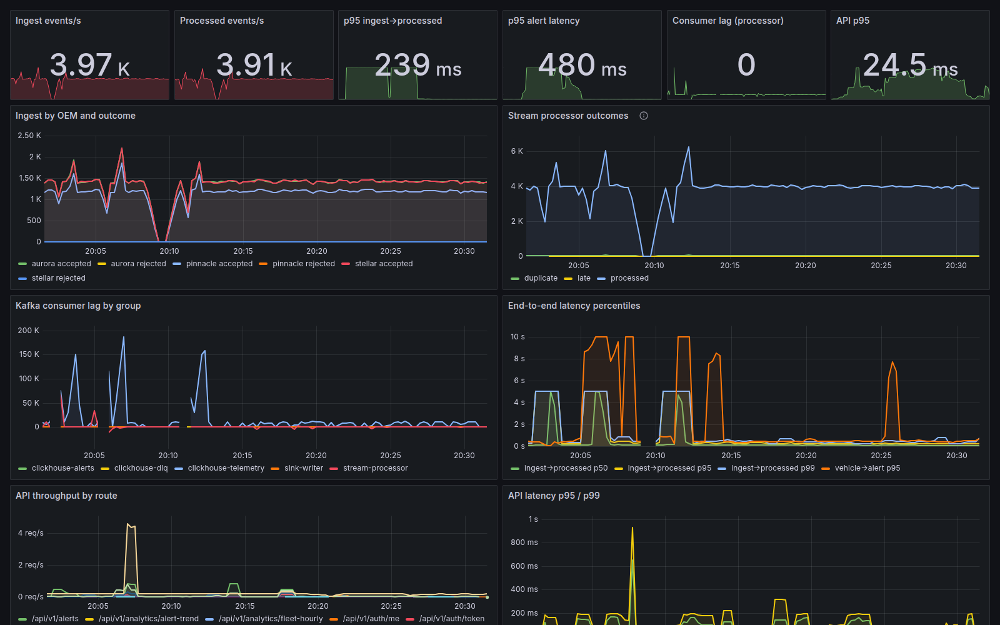

# Observability

## Signals

| Signal | Implementation |
|---|---|
| Metrics | Prometheus client in every service (`/metrics`); Kafka exporter for consumer lag; scraped by Prometheus (compose) or a PodMonitor (Helm) |
| Dashboards | Grafana, provisioned: `deploy/observability/grafana/dashboards/fleetpulse.json` |
| Alerts | `deploy/observability/alerts.yml`: `ConsumerLagHigh`, `IngestToProcessLatencyHigh`, `CriticalAlertLatencyHigh`, `ApiLatencyHigh`, `ApiErrorRate`, `IngestRejectSpike`, `CircuitBreakerOpen`, `IngestBackpressure` |
| Logs | Structured JSON on stdout (Go `slog`, Python JSON formatter), one line per request with `request_id`, route, status, latency, tenant; the same `request_id` is returned in `X-Request-ID` and in every problem+json error |
| Traces | Optional OpenTelemetry for the API (`app/main_otel.py`; install the `otel` extra and set `OTEL_EXPORTER_OTLP_ENDPOINT`). Pipeline events carry `event_id`, `ingest_ms` and `proc_ms`, so a single event can be followed through Kafka, ClickHouse and alerts without trace propagation |

Key metrics: `ingest_events_total{oem,outcome}`, `ingest_batch_seconds`,
`ingest_backpressure_total`, `processor_events_total{result}` (processed,
duplicate, late, unknown_vehicle), `processor_ingest_to_process_seconds`,
`processor_alert_latency_seconds`, `processor_partitions_owned`,
`kafka_consumergroup_lag`, `sink_alert_persist_seconds`,
`api_request_duration_seconds{route}`, `api_circuit_breaker_open{name}`,
`api_audit_dropped_total`, `copilot_tokens_total`, `copilot_latency_seconds`,
`analytics_job_last_success_timestamp`, `analytics_model_metric`.

## Troubleshooting walk-through: "the dashboard feels slow"

1. **Is it the API or the pipeline?** Grafana → *API latency p95/p99* by route.
   If one route spikes (say `/api/v1/vehicles`), it is a query problem; if all
   routes spike together, suspect saturation or a dependency.
2. **Dependency?** `api_circuit_breaker_open` and `/api/v1/admin/dependencies` show
   whether PostgreSQL, ClickHouse or Redis is slow or open-circuited.
3. **Query?** Take the `request_id` from a slow response header, find its log
   line (route, tenant, duration), then check `pg_stat_statements` for the
   statement's mean time and run `EXPLAIN (ANALYZE, BUFFERS)` as the API role
   with the tenant set (`scripts/explain-evidence.sh` shows how). This is
   exactly how the 351 ms vehicle-list plan (security-barrier join) was found
   during load testing.
4. **Pipeline?** If live data is stale rather than the API slow:
   *Consumer lag by group* → which consumer is behind; *Stream processor
   outcomes* → a jump in `unknown_vehicle` or `late` points at data, not
   capacity; *Ingest by OEM and outcome* → one OEM failing validation after a
   format change (DLQ records say which field). This is how the MQTT
   shared-subscription loss was found: gateway intake was one third of the
   simulator's publish rate.
5. **Capacity?** CPU per pod vs HPA targets, `ingest_backpressure_total`
   rising, lag growing across all partitions → scale out (KEDA on lag does this
   automatically); lag on one partition only → hot key or a stuck consumer.
