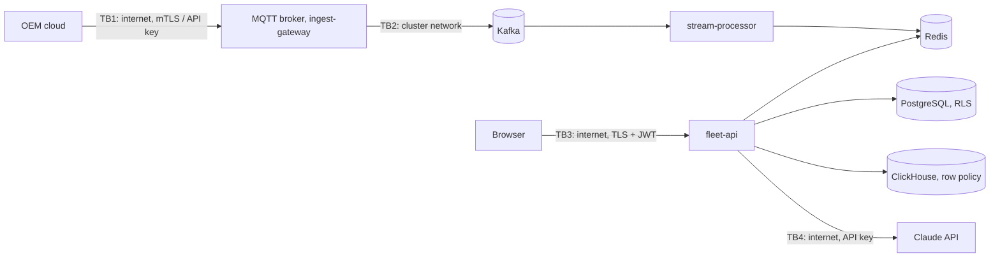

# Security, privacy and compliance

## Threat model (STRIDE)

Scope: the ingestion path (OEM clouds → broker/gateway → Kafka → processors)
and the public API (browser → nginx → fleet-api → stores → LLM).

| # | Threat (STRIDE) | Where | Control | Evidence |
|---|---|---|---|---|
| 1 | **Spoofing** a vehicle or OEM connector to inject fake faults | TB1 | MQTT over TLS with per-connector client certificates in production (gateway supports `MQTT_TLS_*` mTLS; broker ACL restricts each account to its own topic); HTTPS push needs an OEM API key (constant-time compare) plus client-certificate verification at the ingest ingress; VIN check digit and registry lookup reject unknown vehicles | `internal/platform.ClientTLS`, `deploy/mosquitto/acl`, `ingest/gateway.go`, BDD "Connectors must authenticate" |
| 2 | **Information disclosure** across tenants (competing fleets on one platform) | TB3 | Tenant claim in a signed JWT; PostgreSQL RLS on every tenant table with the API connecting as a role without `BYPASSRLS`; security-barrier views over materialised views; ClickHouse row policy on `SQL_tenant_id`; cache keys namespaced by tenant; 404 (not 403) for other tenants' IDs | Integration tests (tenant B cannot read tenant A), BDD "A user cannot read another organisation's vehicle" |
| 3 | **Tampering / repudiation** with the record of who saw or changed what | API, DB | Every authenticated request and every copilot tool call audited asynchronously; a trigger hash-chains rows (`hash = sha256(prev_hash ‖ row)`); a second trigger makes the table append-only (UPDATE/DELETE raise); verification endpoint | `db/…/003_security_rls_audit.sql`, `test_audit_tamper_detection`, BDD "audit hash chain verifies" |
| 4 | **Denial of service**: telemetry floods or API abuse | TB1, TB3 | Gateway bounded in-flight batches → 429/503 back-pressure; Kafka absorbs bursts; per-user sliding-window rate limit (1,200/min) with `Retry-After`; login limited per IP (20/min) and locked after 5 failures for 15 min; request body limits; ingress rate limit | `tests/load/ratelimit.js`, `TestHTTP_BackPressure` |
| 5 | **Elevation of privilege** through the AI copilot (prompt injection, tool misuse) | TB4 | Tools filtered by the caller's permissions before the model sees them; tools execute as the user under RLS; write actions are proposals that need a manager's approval (viewers get 403); injection patterns and input length checked before the model is called; VINs in answers must appear in tool results or are redacted; tool-call budget per question; every tool call audited | `app/agent/guardrails.py`, `app/agent/tools.py`, BDD "The copilot can only propose" |
| 6 | **Information disclosure** of personal data (driver identity, precise location) | API | Least-privilege roles: without `driver:pii` drivers appear as stable pseudonyms; without `location:precise` positions are snapped to the centre of a geohash-5 cell (~4.9 km); driver licence and phone encrypted with AES-256 (`pgcrypto`), searchable only by hash | `app/security/masking.py`, BDD "Analysts see coarse locations" |
| 7 | **Tampering** with events in transit or at rest | TB2 | TLS to Kafka (SASL/SCRAM on MSK), PostgreSQL (`sslmode=verify-full`), Redis (`rediss`), ClickHouse (HTTPS); KMS-encrypted volumes, S3, RDS, MSK, ElastiCache, EKS secrets | `infra/terraform/aws`, Helm values |
| 8 | **Spoofing** of API sessions | TB3 | RS256 JWTs with issuer/audience checks and short TTL (60 min), JWKS published for external verifiers, logout revokes the token ID; WebSocket authenticated with a one-time 24-byte ticket so bearer tokens never appear in URLs | `app/security/jwt.py`, `api/fleet.py` |

## Authentication and authorisation

* **OAuth2 password grant** issuing RS256 JWTs (`/api/v1/auth/token`), with
  `/.well-known/openid-configuration` and JWKS so an external OIDC provider
  can replace the built-in issuer (the API only needs `JWKS_URL`).
* **RBAC:** five roles mapped to fourteen fine-grained permissions
  (`app/security/rbac.py`): platform admin, fleet admin, maintenance manager,
  analyst, viewer. Endpoints declare the permission they need; the UI hides
  what the role cannot use, but the API is the enforcement point.
* **Tenant isolation:** defence in depth: claim in the token → `app.tenant_id`
  per transaction → RLS policy in the database. A bug in a query cannot leak
  another tenant's rows because the database filters them.

## Device identity and encryption

* **Devices / OEM connectors:** mTLS client certificates (issued per OEM
  connector by the platform CA, e.g. cert-manager); the local stack uses
  broker passwords and ACLs as a stand-in. Certificates and API keys are
  rotated by re-issuing into the secret store; the gateway reloads on restart.
* **In transit:** TLS 1.2+ everywhere outside a pod; TLS terminates at the
  ingress (HSTS on TLS hosts); strict CSP and security headers on every response (verified by the ZAP baseline
  rules in `.zap/rules.tsv`).
* **At rest:** AES-256 via KMS for every managed store and volume; PII columns
  additionally encrypted in the application key domain (`PII_ENCRYPTION_KEY`).
* **Secrets:** generated by Terraform into AWS Secrets Manager (KMS-encrypted),
  synced by External Secrets Operator into Kubernetes Secrets (envelope
  encrypted); never in Git, images or Helm history. Local defaults are marked
  `local-only`. CI runs gitleaks on every push.

## Privacy (GDPR, India DPDP Act 2023)

| Principle | Implementation |
|---|---|
| Minimisation | Telemetry is keyed by VIN, not by person; ClickHouse and Redis hold no driver identifiers. Precise location only for roles that need it. |
| Purpose limitation | Analysts and viewers see driver pseudonyms, never names; a per-driver `safety_opt_in` flag is recorded (excluding opted-out drivers from scoring is a planned change). |
| Storage limitation | Raw telemetry deleted after 90 days (ClickHouse TTL, enforced); trips 13 months (policy, automation planned); see `docs/capacity.md`. |
| Right to erasure | `POST /api/v1/compliance/erasure-requests`: overwrites identity fields, destroys encrypted licence/phone, unlinks trips and coarsens their locations to ~20 km, removes assignments, purges caches, and returns a per-store report; idempotent (second request → 409); recorded in the audit chain. |
| Accountability | Tamper-evident audit trail of data access and AI actions, exportable per tenant. |
| Data residency | `tenant.data_region` recorded; one deployment per region with the same chart. |

## AI safety

| Risk | Defence |
|---|---|
| Prompt injection ("ignore previous instructions…") | Pattern screen before any model call (returns a refusal in `guardrail` mode); the system prompt is fixed and cached; tool results are data, never instructions |
| Over-privileged tools | Only tools the user's permissions allow are offered; each executes under the user's identity and RLS |
| Unintended actions | Write tools create `agent_action` proposals; a maintenance manager approves or rejects in the UI; one pending proposal per vehicle |
| Hallucinated vehicles | Every VIN in an answer must appear in the question or a tool result; others are replaced with `[unverified VIN]` and a warning |
| Runaway cost | Tool-call budget per question, bounded `max_tokens`, input length limit (2,000 chars), token usage and estimated cost recorded per answer |
| Provider outage | Server-side model fallbacks, then a deterministic offline planner that answers from the same tools |
| Audit | Question, tools, arguments, proposals, model usage and latency written to the audit chain |

## Security testing

| Layer | Tool | Where |
|---|---|---|
| Secrets | gitleaks | CI `security` job |
| SAST | Semgrep (OWASP Top 10, Python, Go, TypeScript, Dockerfile) | CI `security` job |
| Dependencies | govulncheck, `npm audit`, Trivy filesystem scan | CI |
| IaC | Trivy misconfiguration scan, kubeconform, `terraform validate` | CI `security` and `iac` jobs |
| Images | Trivy image scan (fail on fixable CRITICAL), CycloneDX SBOM per image | CI `images` job |
| DAST | OWASP ZAP baseline against the running stack (header, cookie, CORS and disclosure rules fail the build) | CI `e2e` job |
| Authorisation | Integration and BDD tests for cross-tenant access, role limits, lockout, rate limits | `services/fleet-api/tests`, `tests/bdd` |
